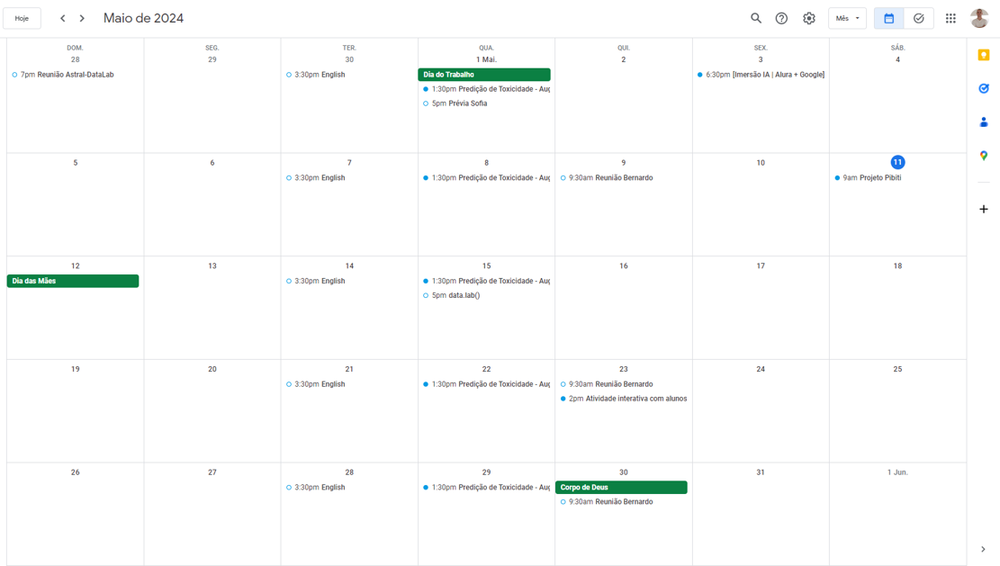
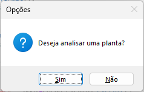
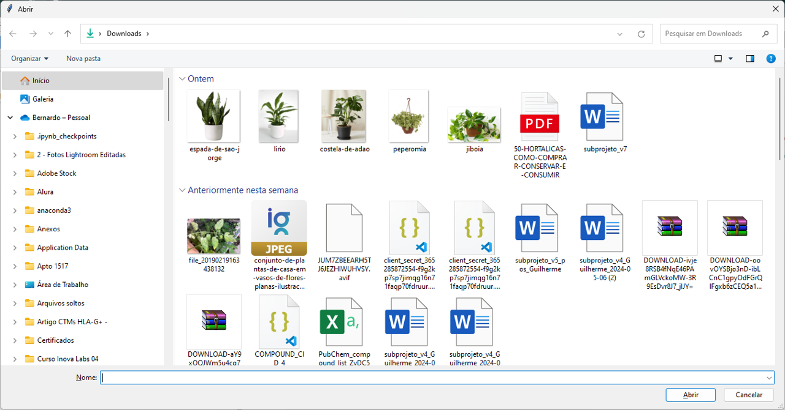
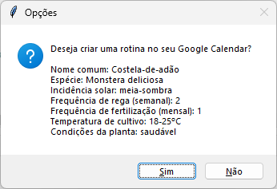
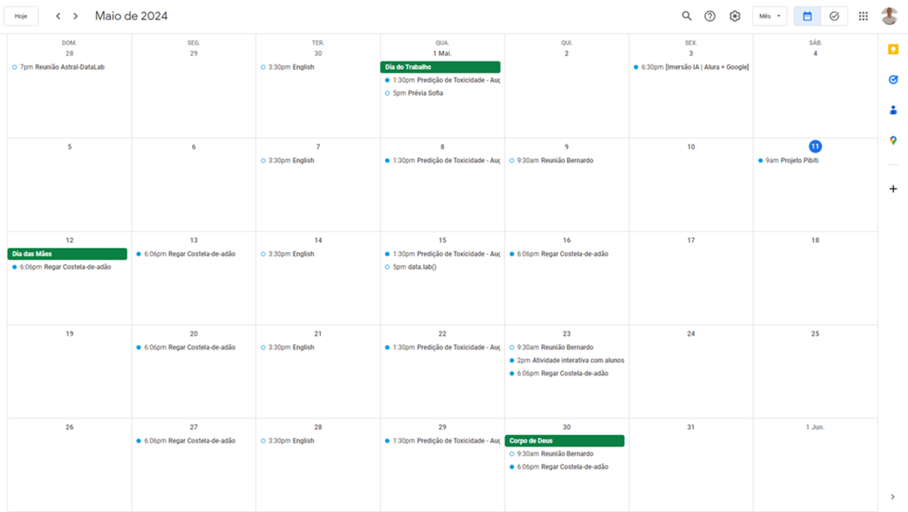

# 🌿 Não Deixe Suas Plantas Morrerem de Sede! 🌿

Você já perdeu plantas por esquecer de regá-las? Se sim, este aplicativo é para você! Com o Lembrete de Regar Plantas, você nunca mais esquecerá de cuidar das suas plantinhas queridas.

## Por que Usar o Lembrete de Regar Plantas?

- **Fácil de Usar:** Basta executar o código e seguir as instruções simples.
- **Lembrete Automático:** Receba lembretes regulares para regar suas plantas, evitando que elas murchem e morram de sede.
- **Personalizável:** Configure a frequência de rega de acordo com as necessidades específicas de cada planta.
- **Integração com Calendário:** Os lembretes são automaticamente adicionados ao seu calendário, para que você possa visualizá-los facilmente em qualquer dispositivo.
- **Ajuda Especializada:** Receba orientação sobre os cuidados ideais para cada tipo de planta, desde a quantidade de luz solar necessária até a temperatura ideal.

## Como Usar

1. **Execute o Aplicativo:** Basta executar o código e seguir as instruções na tela.

2. **Importe uma Imagem da Planta:** Selecione uma imagem da sua planta e deixe o aplicativo analisá-la para determinar suas necessidades de rega.

Selecione uma foto da sua planta.

3. **Receba Lembretes Personalizados:** Com base na análise da imagem, o aplicativo programará automaticamente lembretes de rega personalizados para cada uma de suas plantas.

Crie lembretes de cuidado com a planta de acordo com a frequência de rega.

4. **Cuide das Suas Plantas:** Siga os lembretes e mantenha suas plantas saudáveis e felizes!

Seja notificado pelo Google Calendar!